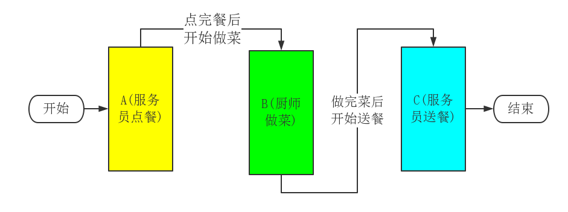

# Phalcon中的事件驱动
[事件管理器(Events Manager)]
----------

## 一、对于事件驱动的理解

假定现在我们开**餐馆**让顾客点餐，那么我们现可以分三步来做，它们分别是：
1. **点餐：**服务员将菜单递给顾客，让顾客点餐。
2. **做菜：**厨师依据顾客点的餐开始做菜。
3. **送餐：**服务员将厨师做好的菜送给该用户。

现在我们分别将其记为A、B、C。现在我们只有在A完成后调用B，B完成后调用C这样我们才能完成这件事。这样就会导致B依赖A，C依赖B。用程序来说就是：
	
	function main(){
		getMenu();
	}
	function getMenu(){
		// 点餐
		cook();
	}
	function cook(){
		// 做菜
		delivery();
	}
	function delivery(){
		// 送餐
	}

事件驱动编程能够解除这种依赖关系。当我们添加一个经理——EM(EventManager)角色，希望服务员点完餐后告诉经理顾客已经点完餐了，而不再是让厨师去做菜了。厨师做完菜后只需要说了一下就行，也不必去让服务员送餐了。即当A完成之后，告诉EM自己的状态(已完成)，让EM去处理，之后的事情就与自己无关了。用程序表示如下：

	function main(){
		// 点餐
		$em->fire('Afinish');// 抛出一个事件，告诉经理 点餐完成
		
		$em->attach('Afinsh', function(){// 监听处理一个事件告诉经理，点餐完成后做菜就可以开始了
			// 做菜
			$em->fire('Bfinish');// 抛出一个事件，告诉经理 菜做完了
		});
		
		$em->attach('Bfinsh', function(){// 监听处理一个事件告诉经理，菜完成后送餐就可以开始了
			// 送餐
		});
	}	

	

### 更进一步
在事件驱动编程中，事件就是整个任务的一个行为状态，可以被事件管理器捕获。事件侦听者与事件绑定在一起，是一个回调函数，表示当对应的事件触发，即任务进行到某一个状态时，该去做什么事。而事件管理器存储着事件与事件侦听者之间的关系，当事件抛出时执行相应的动作。

> 一个事件可以被多个事件侦听器侦听，即一个事件可以绑定多个回调函数。那么当事件触发的时候，就会**冒泡**，依次执行侦听的事件侦听器。当然冒泡可以有优先级，同时冒泡可以中断停止。

参考文章：[Zend Framework 2 事件驱动编程的理解](http://blog.comingx.com/?p=2896#more-2896)

## 二、Phalcon中EM(事件管理器)的作用

Phalcon通过插入大量的事件，将每一个事件都是视作一个**“钩子”**来提高整个框架的拓展性，使得使用者不必修改框架源码，只需要修改Phalcon提供的“钩子”就能够进行自我拓展。

在Invo(Phalcon提供的示例)中，其ACL访问权限的控制就是通过事件调度来实现的。如图所示：

Phalcon中也是这样，我们只需要在关键时刻绑定一个事件，这样我们就无需修改源代码，就能够添加我们所需要的功能。

## 三、Phalcon中EM(事件管理器)的实现

依据上面EM的原理介绍，Phalcon必须实现以下几个接口：
1. 侦听一个事件，即将一个事件监听处理器绑定到一个事件上。
2. 解除对一个事件的侦听，即将一个事件监听处理器从某一个事件上解绑。
3. 移除所有的事件或是某事件上的所有侦听处理器。
4. 获取某一事件的侦听处理器。
5. 抛出一个事件，即触发事件管理器中一个事件并进行侦听处理。

由于EM中需要一个事件库来存储事件及其关系。因此Phalcon通过关联数组来绑定事件名与侦听处理器之间的关系。通常情况下，一个事件可以绑定多个事件侦听器，这些侦听器之间又先后顺序，而他们之间的顺序我们可以通过两种方式进行处理，第一种FIFO(先进先出)，即按照侦听器定义的先后顺序调用，第二种给每个侦听器添加一个权重，即优先级来进行判断。同时在某些情况下，我们希望能够获得侦听器的响应结果，因此我们需要四个成员来表示该事件管理器。如图所示：

----------
### attach的实现

----------
### detach的实现

----------
### fire的实现
