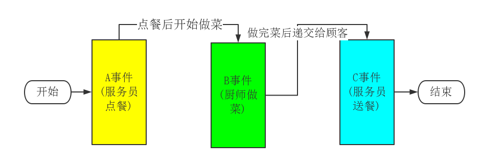
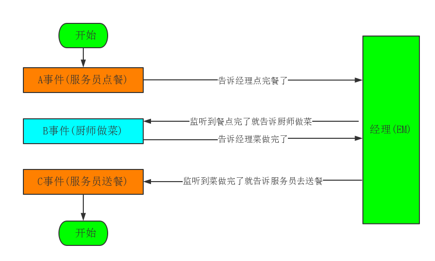
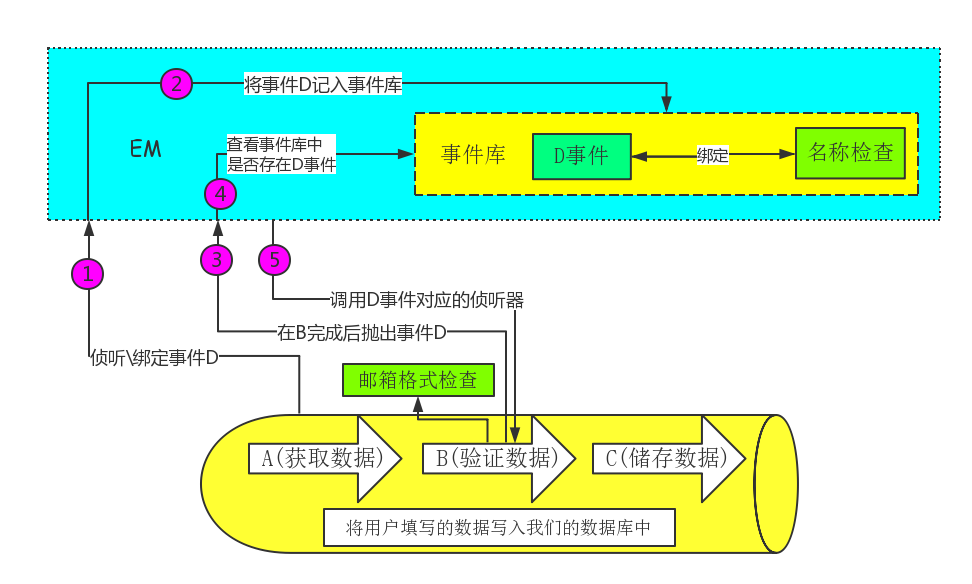

# Phalcon中的事件驱动
[事件管理器(Events Manager)]
----------

实现原理：

Event类——为是时间管理器中触发的事件提供上下信息。

## 一、对于事件驱动的理解

假定现在我们想将用户填写的数据写入我们的数据库中，那么我们现在要做三件事，它们分别是：
1. **取数据：**获取用户的数据(只有获取到用户提供的数据我们才能进行存储)。
2. **检验：**对用户提供的数据进行检验(主要是为了避免无效数据和错误数据)。
3. **存数据：**将检验正确的数据写入数据库之中永久存储起来。

事实上，我们将用户填写的数据写入数据库这件事分成了三个步骤：取数据、检验和存数据，现在我们分别将其记为A、B、C。现在我们只有在A完成后调用B，B完成后调用C这样我们才能完成这件事。这样就会导致B依赖A，C依赖B。用程序来说就是：
	
	function main(){
		getData();
	}
	function getData(){
		// 获取用户填写的数据
		checkout();
	}
	function checkout(){
		// 检验数据
		saveData();
	}
	function saveData(){
		// 存数据
	}

事件驱动编程能够解除这种依赖关系。当我们添加一个EM(EventManager)角色，希望当A完成之后，告诉EM自己的状态(已完成)，让EM去处理，之后的事情就与自己无关了。用程序表示如下：

	function main(){
		// 获取用户填写的数据
		$em->fire('Afinish');// 抛出一个事件，告诉EM A完成
		
		$em->attach('Afinsh', function(){// 绑定一个事件告诉EM，A完成后B就可以开始了
			// 检验数据
			$em->fire('Bfinish');// 抛出一个事件，告诉EM B完成
		});
		
		$em->attach('Bfinsh', function(){// 绑定一个事件告诉EM，B完成后C就可以开始了
			// 存数据
		});
	}	

	

### 更进一步
在事件驱动编程中，事件就是整个任务的一个行为状态，可以被事件管理器捕获。事件侦听者与事件绑定在一起，是一个回调函数，表示当对应的事件触发，即任务进行到某一个状态时，该去做什么事。而事件管理器存储着事件与事件侦听者之间的关系，当事件抛出时执行相应的动作。

> 一个事件可以被多个事件侦听器侦听，即一个事件可以绑定多个回调函数。那么当事件触发的时候，就会**冒泡**，依次执行侦听的事件侦听器。当然冒泡可以有优先级，同时冒泡可以中断停止。

参考文章：[Zend Framework 2 事件驱动编程的理解](http://blog.comingx.com/?p=2896#more-2896)

## 二、Phalcon中EM(事件管理器)的作用

Phalcon通过插入大量的事件，将每一个事件都是视作一个**“钩子”**来提高整个框架的拓展性，使得使用者不必修改框架源码，只需要修改Phalcon提供的“钩子”就能够进行自我拓展。

例如刚才我写了一个将用户填写数据写入数据库的程序，但是我只检验了用户的邮箱格式是否有问题。现在我想加一个名称检验功能，例如用户的名字不能包含某个字，再不修改源文件的情况下，我们可以通过抛出一个事件来进行拓展，如图：

Phalcon中也是这样，我们只需要在关键时刻绑定一个事件，这样我们就无需修改源代码，就能够添加我们所需要的功能。

## 三、Phalcon中EM(事件管理器)的实现

EM的原理介绍，Phalcon必须实现以下几个接口：
1. 侦听一个事件，即将一个事件监听处理器绑定到一个事件上。
2. 解除对一个事件的侦听，即将一个事件监听处理器从某一个事件上解绑。
3. 移除所有的事件或是某事件上的所有侦听处理器。
4. 获取某一事件的侦听处理器。
5. 抛出一个事件，即触发事件管理器中一个事件并进行侦听处理。

由于EM中需要一个事件库来存储事件及其关系。因此Phalcon通过关联数组来绑定事件名与侦听处理器之间的关系。通常情况下，一个事件可以绑定多个事件侦听器，因此Phalcon通过